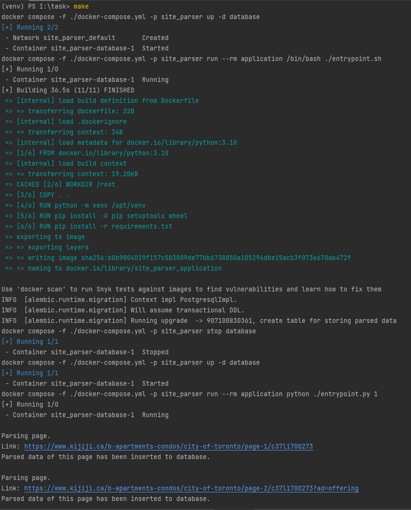

# First run:
___


## Clone project from git repository
```shell
git clone https://github.com/paivazov/parser.git
```

<p style="color: red">Note: to run parser, You need to have pre-installed Makefile and Docker.</p>

## Run parser from first page
All you need is to run the following command from root directory of the project:
```shell
make
```
After that, docker will build container and start parse site:


After first run recommended to use this command:
```shell
make parse
```
---
## Extended commands
To apply migrations:
```shell
make migrations
```
Target that allows to connect to parser's container and run required commands.
After you finish your job inside "backend" container and
hits the "exit" command (or just Ctrl+D) this target gracefully stops all
dependent containers.
```shell
make visit_to_app
```
E.g. you may use this command to start parser manually inside a container:
```shell
python entrypoint.py [<page you want parsing from>]
```
Or run alembic's migrations:
```shell
cd db
# And then
alembic upgrade head
```

## DB dump
Also, repo has example of dump in [dump.csv](./dump.csv) file.
